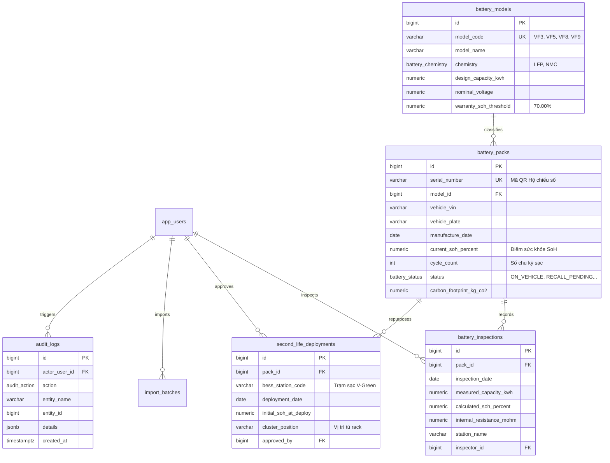

# Từ Điển Cơ Sở Dữ Liệu — vsf_battery

## Sơ đồ Thực thể (ER Diagram - Mermaid)

```mermaid
erDiagram
    app_users ||--o{ battery_inspections : inspects
    app_users ||--o{ second_life_deployments : approves
    app_users ||--o{ import_batches : imports
    app_users ||--o{ audit_logs : triggers

    battery_models ||--o{ battery_packs : classifies
    battery_packs ||--o{ battery_inspections : records
    battery_packs ||--o{ second_life_deployments : repurposes

    battery_models {
        bigint id PK
        varchar model_code UK "VF3, VF5, VF8, VF9"
        varchar model_name
        battery_chemistry chemistry "LFP, NMC"
        numeric design_capacity_kwh
        numeric nominal_voltage
        numeric warranty_soh_threshold "70.00%"
    }

    battery_packs {
        bigint id PK
        varchar serial_number UK "Mã QR Hộ chiếu số"
        bigint model_id FK
        varchar vehicle_vin
        varchar vehicle_plate
        date manufacture_date
        numeric current_soh_percent "Điểm sức khỏe SoH"
        int cycle_count "Số chu kỳ sạc"
        battery_status status "ON_VEHICLE, RECALL_PENDING..."
        numeric carbon_footprint_kg_co2
    }

    battery_inspections {
        bigint id PK
        bigint pack_id FK
        date inspection_date
        numeric measured_capacity_kwh
        numeric calculated_soh_percent
        numeric internal_resistance_mohm
        varchar station_name
        bigint inspector_id FK
    }

    second_life_deployments {
        bigint id PK
        bigint pack_id FK
        varchar bess_station_code "Trạm sạc V-Green"
        date deployment_date
        numeric initial_soh_at_deploy
        varchar cluster_position "Vị trí tủ rack"
        bigint approved_by FK
    }

    audit_logs {
        bigint id PK
        bigint actor_user_id FK
        audit_action action
        varchar entity_name
        bigint entity_id
        jsonb details
        timestamptz created_at
    }
```

File DDL chính thức: `src/database/vsf_battery.sql`.
