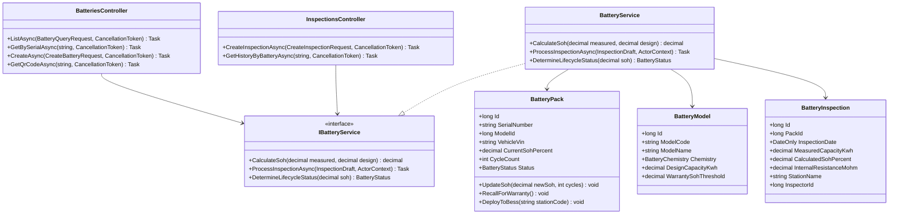

# Sơ Đồ Lớp (Core Class Diagrams)

## 1. Module Quản Lý Pin & Kiểm Định (Battery & Inspection)

```mermaid
classDiagram
    direction TB

    class BatteriesController {
        +ListAsync(BatteryQueryRequest, CancellationToken) Task
        +GetBySerialAsync(string, CancellationToken) Task
        +CreateAsync(CreateBatteryRequest, CancellationToken) Task
        +GetQrCodeAsync(string, CancellationToken) Task
    }

    class InspectionsController {
        +CreateInspectionAsync(CreateInspectionRequest, CancellationToken) Task
        +GetHistoryByBatteryAsync(string, CancellationToken) Task
    }

    class IBatteryService {
        <<interface>>
        +CalculateSoh(decimal measured, decimal design) decimal
        +ProcessInspectionAsync(InspectionDraft, ActorContext) Task
        +DetermineLifecycleStatus(decimal soh) BatteryStatus
    }

    class BatteryService {
        +CalculateSoh(decimal measured, decimal design) decimal
        +ProcessInspectionAsync(InspectionDraft, ActorContext) Task
        +DetermineLifecycleStatus(decimal soh) BatteryStatus
    }

    class BatteryPack {
        +long Id
        +string SerialNumber
        +long ModelId
        +string VehicleVin
        +decimal CurrentSohPercent
        +int CycleCount
        +BatteryStatus Status
        +UpdateSoh(decimal newSoh, int cycles) void
        +RecallForWarranty() void
        +DeployToBess(string stationCode) void
    }

    class BatteryModel {
        +long Id
        +string ModelCode
        +string ModelName
        +BatteryChemistry Chemistry
        +decimal DesignCapacityKwh
        +decimal WarrantySohThreshold
    }

    class BatteryInspection {
        +long Id
        +long PackId
        +DateOnly InspectionDate
        +decimal MeasuredCapacityKwh
        +decimal CalculatedSohPercent
        +decimal InternalResistanceMohm
        +string StationName
        +long InspectorId
    }

    BatteriesController --> IBatteryService
    InspectionsController --> IBatteryService
    BatteryService ..|> IBatteryService
    BatteryService --> BatteryPack
    BatteryService --> BatteryModel
    BatteryService --> BatteryInspection
```
