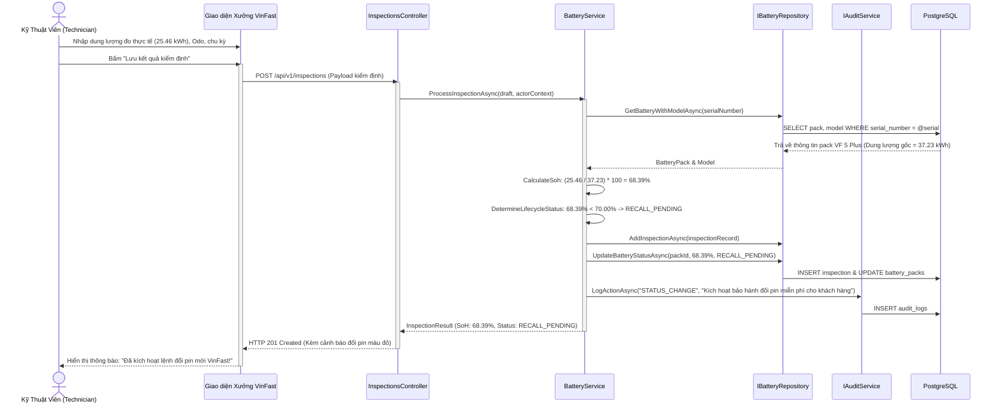
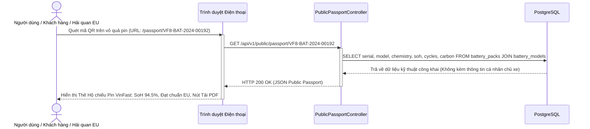

# Sơ Đồ Tuần Tự (Sequence Diagrams)

## 1. Luồng Kiểm Định Pin & Tự Động Kích Hoạt Đổi Pin Miễn Phí (< 70%)

```mermaid
sequenceDiagram
    actor Tech as Kỹ Thuật Viên (Technician)
    participant UI as Giao diện Xưởng VinFast
    participant API as InspectionsController
    participant Svc as BatteryService
    participant Repo as IBatteryRepository
    participant Audit as IAuditService
    participant DB as PostgreSQL

    Tech->>UI: Nhập dung lượng đo thực tế (25.46 kWh), Odo, chu kỳ
    Tech->>UI: Bấm "Lưu kết quả kiểm định"
    activate UI
    UI->>API: POST /api/v1/inspections (Payload kiểm định)
    activate API

    API->>Svc: ProcessInspectionAsync(draft, actorContext)
    activate Svc

    Svc->>Repo: GetBatteryWithModelAsync(serialNumber)
    Repo->>DB: SELECT pack, model WHERE serial_number = @serial
    DB-->>Repo: Trả về thông tin pack VF 5 Plus (Dung lượng gốc = 37.23 kWh)
    Repo-->>Svc: BatteryPack & Model

    Svc->>Svc: CalculateSoh: (25.46 / 37.23) * 100 = 68.39%
    Svc->>Svc: DetermineLifecycleStatus: 68.39% < 70.00% -> RECALL_PENDING

    Svc->>Repo: AddInspectionAsync(inspectionRecord)
    Svc->>Repo: UpdateBatteryStatusAsync(packId, 68.39%, RECALL_PENDING)
    Repo->>DB: INSERT inspection & UPDATE battery_packs

    Svc->>Audit: LogActionAsync("STATUS_CHANGE", "Kích hoạt bảo hành đổi pin miễn phí cho khách hàng")
    Audit->>DB: INSERT audit_logs

    Svc-->>API: InspectionResult (SoH: 68.39%, Status: RECALL_PENDING)
    deactivate Svc

    API-->>UI: HTTP 201 Created (Kèm cảnh báo đổi pin màu đỏ)
    deactivate API
    UI-->>Tech: Hiển thị thông báo: "Đã kích hoạt lệnh đổi pin mới VinFast!"
    deactivate UI
```

## 2. Luồng Quét QR Tra Cứu Hộ Chiếu Pin Công Khai (Mobile Public Passport)

```mermaid
sequenceDiagram
    actor User as Người dùng / Khách hàng / Hải quan EU
    participant Mobile as Trình duyệt Điện thoại
    participant API as PublicPassportController
    participant DB as PostgreSQL

    User->>Mobile: Quét mã QR trên vỏ quả pin (URL: /passport/VF8-BAT-2024-00192)
    activate Mobile
    Mobile->>API: GET /api/v1/public/passport/VF8-BAT-2024-00192
    activate API

    API->>DB: SELECT serial, model, chemistry, soh, cycles, carbon FROM battery_packs JOIN battery_models
    DB-->>API: Trả về dữ liệu kỹ thuật công khai (Không kèm thông tin cá nhân chủ xe)

    API-->>Mobile: HTTP 200 OK (JSON Public Passport)
    deactivate API

    Mobile-->>User: Hiển thị Thẻ Hộ chiếu Pin VinFast: SoH 94.5%, Đạt chuẩn EU, Nút Tải PDF
    deactivate Mobile
```
